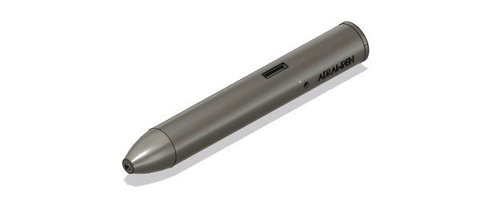

# AIDrawPen Mechanical Design

<table>
  <tr>
    <td></td>
    
    
   <td></td>
    
   </tr>
</table>
 
 
  

## Introduction

The AIDrawPen is a smart drawing pen designed to help children with developmental disorders improve their fine motor skills. This repository contains the mechanical design files for the AIDrawPen, including 3D models, assembly instructions, and component specifications.

## Features

- **Ergonomic Design**: Ensures comfortable use for children.
- **Durable Materials**: Built to withstand regular use.
- **Compact and Lightweight**: Easy to handle and maneuver.
- **Easy Assembly**: Simplified construction for straightforward assembly and maintenance.
 
 

 
