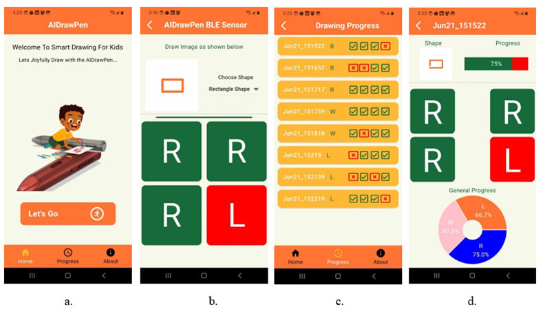

# AIDrawPen Mobile App (aidrawpen)

<table>
  <tr>
    <td></td>
   </tr>
</table> 

## Introduction

The AIDrawPen Mobile App is designed to work with the AIDrawPen device, providing an interactive and engaging platform for children with developmental disorders to improve their fine motor skills. The app connects to the AIDrawPen via Bluetooth Low Energy (BLE) and offers real-time feedback, progress tracking, and personalized exercises.

## Features

- **Real-time Feedback**: Immediate feedback on drawing gestures.
- **Progress Tracking**: Monitor and record the user's improvement over time.
- **Personalized Exercises**: Tailored exercises to enhance motor skills.
- **User-friendly Interface**: Easy-to-use interface suitable for children.

## Prerequisites

- **AIDrawPen Device**: Ensure the device is powered on and in range.
- **Mobile Device**: Android device with BLE capability.

## Installation

### Android

- Download and Install the [APK](apk) on your Android device. 

## Usage

1. **Connect to AIDrawPen**: Open the app and connect to the AIDrawPen device via BLE.
2. **Start Session**: Select a drawing exercise and begin.
3. **Receive Feedback**: Follow the on-screen instructions and receive real-time feedback.
4. **Track Progress**: View progress reports and history.

