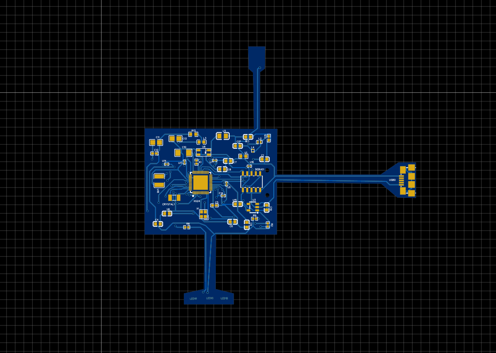
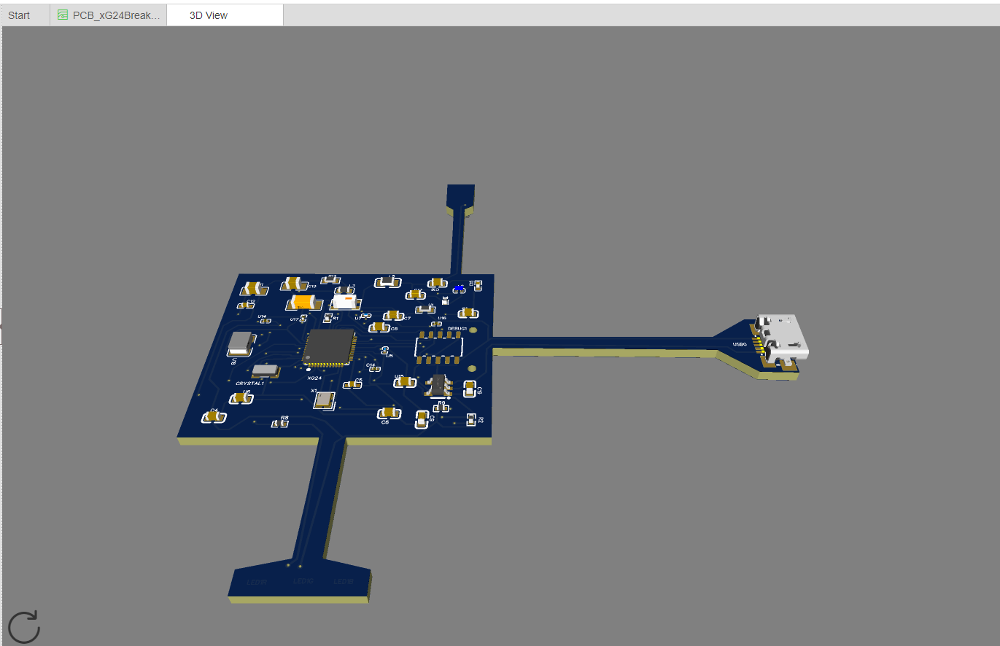
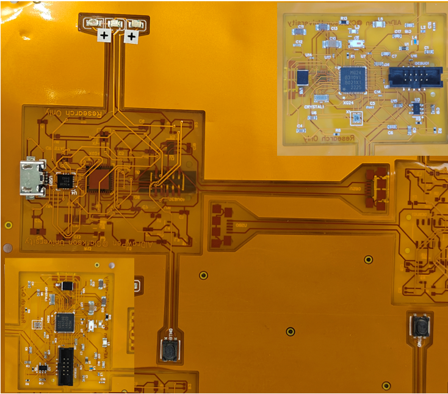

# AIDrawPen PCB

<table>
  <tr>
    <td></td> 
   <td></td>
   </tr> 
   <tr> 
    
  <td></td>
   </tr> 
</table>

## Overview

The AIDrawPen PCB is a custom-designed printed circuit board (PCB) that integrates all necessary components for the AIDrawPen device. The PCB is powered by a coin-cell battery and includes essential electronics such as a BLE microcontroller and an Inertial Measurement Unit (IMU).

## Features

- **BLE Microcontroller**: EFR32MG32 for wireless communication.
- **Inertial Measurement Unit**: ICM-20689 for accurate motion sensing.
- **Power Supply**: Coin-cell battery for portable operation.
- **Compact Design**: Small and lightweight for ease of use in a pen form factor.

## Getting Started

### Prerequisites

- PCB design files (Gerber files)
- Access to a PCB manufacturing service
- Soldering equipment and components

