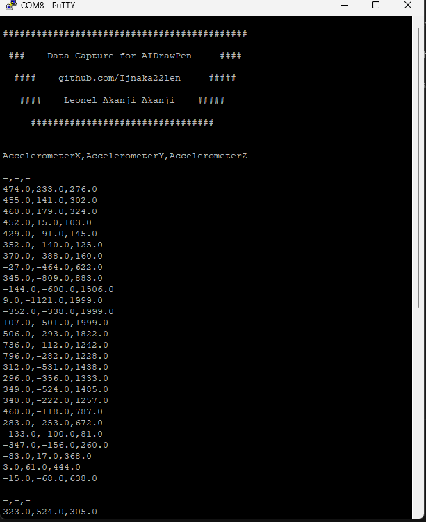
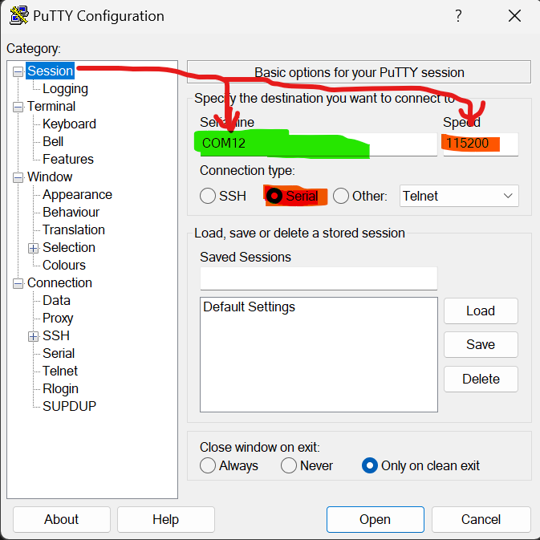
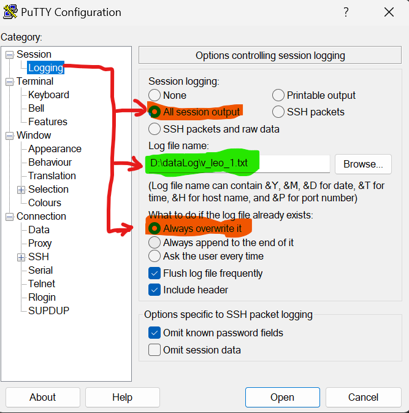
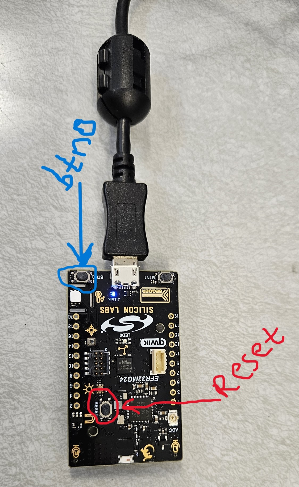

# Data Capture for AIDrawPen Manual
<table>
  <tr>
    <td></td>
  </tr> 
</table>

## 1. Create Folder for Data Collection
- Create a folder named `dataLog/`.
- Download and upload the the [hexImuXYZDataCapure.hex
](imuXYZDataCapure/hexImuXYZDataCapure.hex) file to the xG24 board.

## 2. File Naming and Configuration
- Use Putty for configuration.
- Save all files as text files with the `.txt` extension, e.g., `dataLog/v_leo_1.txt`.
- File naming format: `{shape}_{yourname}_{session}.txt`.
<table>
  <tr>
    <td></td>
    <td></td>               
  </tr> 
</table>

## 3. Using Putty Terminal
- Open the Putty terminal.
- Press the middle button (Reset) once.
- Hold the xG24 board horizontally and press the right-side button (btn0) to start recording data (drawing shapes).
- Release the button when done drawing the shape. Repeat for multiple shapes.
- Draw at least 60 shapes.
- Close the Putty terminal and repeat steps 2-3 for new sessions.
<table>
  <tr>
    <td></td>
  </tr> 
</table> 

