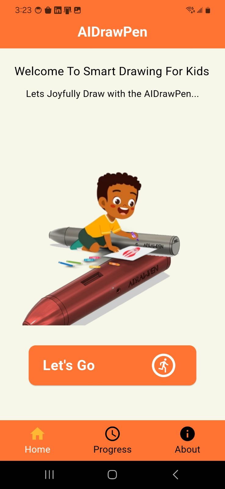
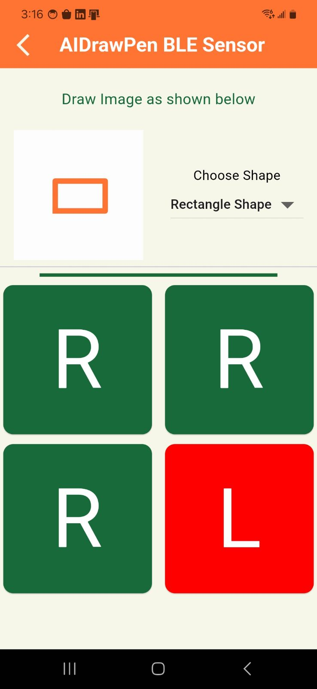

# AIDrawPen

<table>
  <tr>
    <td></td>
    <td></td>
     <td></td>
     <td></td>

  </tr>
</table>
<table>
  <tr>
    <td></td>
   </tr>
</table>
</br>
</br>
</br>

## Overview

AIDrawPen is an innovative application designed to assist in the rehabilitation of children through a wireless gesture-based drawing pen. This project aims to make rehabilitation exercises more engaging and fun for kids, encouraging them to participate actively in their therapy sessions. The pen allows kids to draw and interact with digital interfaces using gestures, making the rehabilitation process more interactive and enjoyable.

## Features

- **Wireless Gesture-Based Drawing Pen**: Designed for kids to draw and interact using gestures.
- **Engaging and Interactive**: Makes rehabilitation exercises fun and engaging.
- **Progress Tracking**: Monitors and visualizes children's progress over time.
- **User-Friendly Interface**: Tailored specifically for children.
- **Tiny ML Model Deployment**: Real-time shape recognition for circles, V-shapes, L-shapes, W-shapes, triangles, etc. using a model deployed on the EFR32MG32 microcontroller.
- **History of Drawing Activities**: Detailed history tracking for monitoring improvements.

## Tiny ML Model

The AIDrawPen project incorporates a tiny Machine Learning (ML) model capable of recognizing basic shapes such as circles, V-shapes, L-shapes, W-shapes, triangles, etc. This model is deployed on the EFR32MG32 microcontroller, enabling real-time shape recognition. By utilizing this model, the pen can accurately detect and interpret the shapes drawn by children, providing immediate feedback and tracking their progress.

## Getting Started

### Prerequisites

- [Flutter](https://flutter.dev/docs/get-started/install) - Ensure you have Flutter installed on your system.
- EFR32MG32 microcontroller.

### Installation

1. **Clone the repository:**

   ```bash
   git clone https://github.com/ijnaka22len/aidrawpen.git
   cd aidrawpen
   ```

2. **CInstall dependencies:**

   ```bash
   flutter pub get
   ```

3. **Run the application:**

  ```bash
  flutter run
  ```

### Project Structure

- [AIDrawPen_Firmware/](AIDrawPen_Firmware/): Contains the code for the AIDrawPen firmware.
- [AIDrawPen_MobileApp/](AIDrawPen_MobileApp/): Contains the code for AIDrawPen mobile app.
- [AIDrawPen_Mechanical/](AIDrawPen_Mechanical/): Contains the mechanical design of AIDrawPen.
- [AIDrawPen_PCB/](AIDrawPen_PCB/): Contains the electronic(PCB) design of AIDrawPen.
- [DataCollection/](DataCollection/): Contains files and python code for gathering data and training tinyML model.
- [Animations/](Animations/): Contains python code to create animation for shapes for the various classes.

## Usage

Once the application is running, the user can:

- Use the drawing pen to draw shapes. View the progress and feedback for each drawing session.
Navigate through the application to see historical data and details.

## Project Information

- Project Name: AIDrawPen
- Goal: Designing AIDrawPen: A Wireless Gesture-Based Drawing Pen for Kids' Rehabilitation.
- Description: This project is aimed at creating a fun and interactive way for children to undergo rehabilitation exercises using a gesture-based drawing pen. By making the rehabilitation process engaging, it helps children to participate more actively and achieve better outcomes.

## Author

This application was developed by `Leonel A.`, a passionate software developer with a keen interest in creating tools that enhance productivity and creativity. With a background in mobile app development and a commitment to improving children’s health and rehabilitation, `AIDrawPen` brings together the best of both worlds to deliver a unique and useful application for kids.

## Contributing

We welcome contributions to AIDrawPen. If you have an idea for a feature or find a bug, please open an issue or submit a pull request. Follow these steps to contribute:

1. Fork the repository.
2. Create a new branch: `git checkout -b feature-name`
3. Make your changes and commit them: `git commit -m 'Add some feature'`
4. Push to the branch: `git push origin feature-name`
5. Open a pull request.
